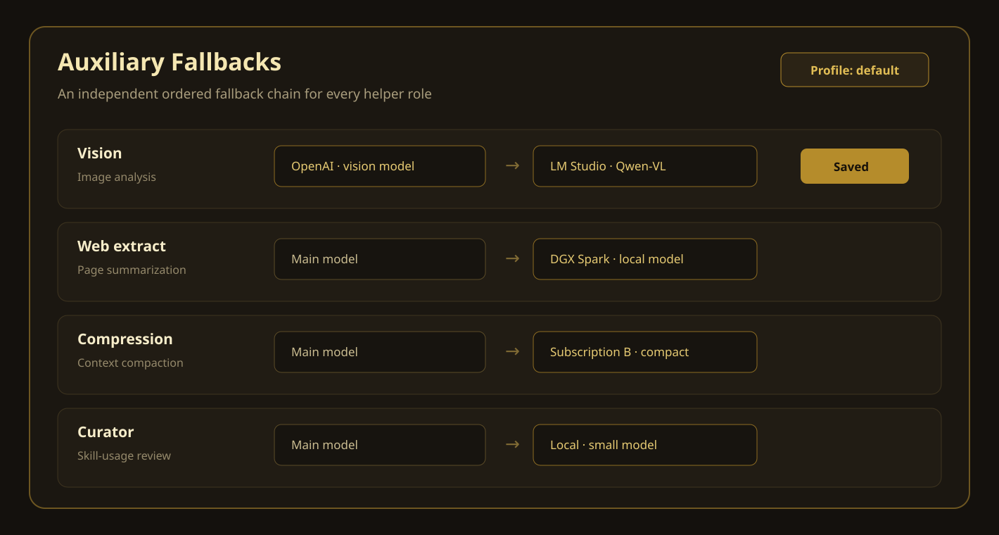

# 🔁 Hermes Auxiliary Fallbacks

> Give every Hermes Agent helper role its own ordered model fallback chain.


[](LICENSE)




**What is this?** A standalone Hermes Agent extension that lets Vision, Web extract, Compression, Skills hub, Approval, MCP, Title generation, Curator, and installed advanced roles use different fallback models. The picker uses providers and models that you already set up in Hermes Settings.

For example, a local text-only model can stay as the main chat model. Vision can use an OpenAI subscription first and a local Qwen-VL model second. Compression and Curator can use different chains.

> **Source-safe by design:** this project does not change the Hermes Agent source tree or Electron application files. It installs only standalone Agent and Desktop plugin folders under the selected Hermes data home. Read [SECURITY.md](SECURITY.md) for all local writes and network effects.

---

## ⚡ Quick start

Hermes Auxiliary Fallbacks is tested on Windows with the current Hermes Agent 0.20.0 configuration API.

```powershell
git clone https://github.com/Elevatormusic/hermes-auxiliary-fallbacks.git
Set-Location .\hermes-auxiliary-fallbacks
.\scripts\install.ps1 -RestartGateway
```

Open Hermes Desktop and select **Auxiliary Fallbacks** in the sidebar. If the page does not appear, use **Reload desktop plugins** in the command palette.

## ✨ What it adds

- One independent ordered fallback chain for each auxiliary role.
- The standard Hermes model catalog, with only configured providers and models.
- Default, named-profile, and all-profile installation modes.
- Safe reordering for existing models that are temporarily offline.
- Redacted API responses. Provider credentials do not go to the Desktop page.
- Optimistic write control to stop stale pages from replacing newer configuration.
- Protection for managed settings and legacy entries that the editor cannot represent safely.
- An Advanced section for auxiliary roles that the installed Hermes version adds.

| Role | Typical work | Example fallback |
|---|---|---|
| Vision | Image analysis | Subscription vision model → local vision model |
| Web extract | Page summarization | Small cloud model → local text model |
| Compression | Context compaction | Fast subscription model → local compact model |
| Skills hub | Skill search | Dedicated search model → main model |
| Approval | Smart auto-approval | High-accuracy model → local policy model |
| MCP | Tool routing | Tool-capable model → another configured tool model |
| Title generation | Session titles | Small low-cost model → local model |
| Curator | Skill-usage review | Review model → local model |

Hermes Agent already runs `auxiliary.<role>.fallback_chain`. This extension manages that existing setting. It does not replace Hermes retry, quota detection, authentication, or provider code.

Hermes tries a role chain before its general safety routes. Hermes 0.20 can still use the main model or main fallback chain after a role chain is exhausted.

## 🔄 What survives a Hermes update?

| Item | After a normal Hermes update |
|---|---|
| Saved fallback chains | Stay in the selected Hermes profile configuration. |
| Provider logins and setup | Stay under Hermes control. This plugin does not copy them. |
| Standalone plugin files | Usually stay in the Hermes data home. Run the installer again if an update removes them. |
| Hermes source and Electron files | Never changed by this project. |

Hermes can change its plugin contract in a future release. Version 1.0.1 is verified with a Hermes Agent 0.20.0 build that provides `read_user_config_raw`. The backend blocks writes on older or incompatible builds and reports a clear compatibility error. A newer Hermes version can still need a plugin update.

## Requirements

- Windows PowerShell 5.1 or newer for the included install and removal scripts.
- Hermes Agent 0.20.0 or a newer compatible version that provides the current uncached read, auxiliary picker, exact-key write, Desktop Plugin SDK, auxiliary fallback-chain, and dashboard route APIs.
- Hermes Desktop for the graphical page.
- A vision-capable model for each Vision fallback. A text-only Qwen model cannot analyze images; use Qwen-VL or another vision model.

## 📥 Install

Run PowerShell from this repository. With no profile option, the script installs to the default Hermes home:

```powershell
.\scripts\install.ps1 -RestartGateway
```

Install to one existing named profile:

```powershell
.\scripts\install.ps1 -Profile work -RestartGateway
```

Install to the default profile and all existing named profiles:

```powershell
.\scripts\install.ps1 -AllProfiles -RestartGateway
```

Use `-HermesHome` only for a custom Hermes home that is not a standard named profile:

```powershell
.\scripts\install.ps1 -HermesHome "D:\HermesData"
```

`-HermesHome`, `-Profile`, and `-AllProfiles` are mutually exclusive. The scripts use the installed Hermes profile API to validate named profiles. An all-profile install uses one rollback boundary. If one profile fails, rollback changes only this plugin's allow-list membership in the latest configuration. It keeps unrelated current settings. A transaction receipt identifies a prepared replacement and makes an interrupted write recoverable. Rollback stops when the membership or receipt evidence is ambiguous. Do not edit Hermes plugin settings while installation or removal is in progress. Failed copied plugin folders move to the dated backup instead of being deleted.

The installer copies files to these Hermes data folders:

```text
<HERMES_HOME>/plugins/auxiliary-fallbacks/
<HERMES_HOME>/desktop-plugins/auxiliary-fallbacks/
```

It also enables the backend plugin in each selected Hermes profile. Hermes Desktop uses a separate Desktop plugin folder for each profile, so both plugin folders are copied into each selected profile home. The script does not write to the Hermes Agent source directory.

Open Hermes Desktop. If the new page does not appear after a few seconds, use the command palette action **Reload desktop plugins**. Select **Auxiliary Fallbacks** in the sidebar.

## Configure a role

1. Set up or sign in to each provider on the normal Hermes Settings page.
2. Open **Auxiliary Fallbacks**.
3. Select **Add fallback** for a role.
4. Select a provider and model from the Hermes model catalog.
5. Add more entries or change their order.
6. Select **Save chain**.

For Vision, select a model that accepts image input. A text-only Qwen model cannot analyze an image. Use a Qwen-VL model or another vision model for a local Vision fallback.

## 🗑️ Remove

The removal script moves the installed files to a dated backup folder and disables the backend:

```powershell
.\scripts\uninstall.ps1 -RestartGateway
```

Use the same selection option that you used during installation:

```powershell
.\scripts\uninstall.ps1 -Profile work -RestartGateway
.\scripts\uninstall.ps1 -AllProfiles -RestartGateway
.\scripts\uninstall.ps1 -HermesHome "D:\HermesData"
```

The script does not remove saved fallback chains. This rule prevents accidental loss of user configuration.

## 🧪 Test

Create a workspace virtual environment and run the focused tests:

```powershell
python -m venv .venv
& .\.venv\Scripts\python.exe -m pip install -r .\requirements-dev.txt
& .\.venv\Scripts\python.exe -m pytest -q
node --check .\plugin\desktop\auxiliary-fallbacks\plugin.js
```

This command does not change the Hermes virtual environment. GitHub Actions runs the same Python tests, Desktop JavaScript syntax check, Python compile check, and Windows PowerShell parser check.

<details>
<summary><b>Run the live Vision fallback test</b></summary>

> **Data and cost warning:** this test sends the selected image to the real fallback provider. It can use subscription quota or incur a charge. It also prints image-derived JSON to the terminal. Use only a non-sensitive test image and an account that you control.

The live vision test is in `scripts/vision_fallback_smoke.py`. It creates a UUID-named temporary Hermes profile, saves the Vision fallback through this plugin API, and starts a loopback endpoint that returns a quota error. Hermes must read the saved chain from disk and send the same image request to the configured real fallback. The test checks that active configuration and profile files do not change. It removes the temporary profile after a clean run. If protected-file drift occurs, it preserves the temporary profile and reports its path for diagnosis.

```powershell
& "$env:LOCALAPPDATA\hermes\hermes-agent\venv\Scripts\python.exe" -B .\scripts\vision_fallback_smoke.py `
  --image "C:\path\to\image.png" `
  --fallback-provider openai-codex `
  --fallback-model gpt-5.6-terra `
  --fallback-timeout 180 `
  --expect "Auxiliary models" `
  --expect "Vision" `
  --expect "Curator" `
  --expect "8"
```

To test the installed backend instead of the workspace copy, add:

```powershell
--plugin-api "$env:LOCALAPPDATA\hermes\plugins\auxiliary-fallbacks\dashboard\plugin_api.py"
```

For a named profile installation, use that profile's installed API path under `$env:LOCALAPPDATA\hermes\profiles\<name>\plugins\auxiliary-fallbacks\dashboard\plugin_api.py`. The smoke test still creates a separate temporary profile under the Hermes root and does not select or modify the active profile.

Use expected text and counts that are unique to the test image. The test fails if the result does not have the requested structured image-analysis fields.

The temporary-profile test is designed for registered and OAuth providers such as `openai-codex`. It copies only a small safe subset of custom-provider settings. A custom endpoint that needs extra headers or other extended fields can fail the test setup. This limit applies only to the smoke test. The installed plugin reads the full Hermes model catalog and does not copy provider settings.

</details>

## Security limits

- The backend accepts only known auxiliary role names.
- A chain has at most eight entries.
- Each entry must contain a complete provider and model pair.
- The provider and model must exist in the configured Hermes model catalog.
- The backend rejects duplicate entries and a fallback that equals the explicit primary route.
- Existing route metadata stays in the configuration only when the provider and model pair stays the same.
- API keys and other secret fields are never returned by the extension API.
- Every request rejects a profile home or `config.yaml` path that uses a symlink, junction, or other reparse point. It also rejects a profile inside a Hermes Agent source tree.

See [SECURITY.md](SECURITY.md) for the full write boundary, rollback behavior, network effects, and vulnerability-reporting guidance.

## Verification

Version 1.0.1 was verified with a current Hermes Agent 0.20.0 build on Windows:

- 84 focused Python tests passed. Three expected platform-specific tests were skipped on Windows and run in Ubuntu CI.
- Python compile, Desktop plugin syntax, and Windows PowerShell 5.1 parser checks passed.
- Install and removal scripts rejected Hermes source-tree targets.
- The installed backend returned all eight standard roles and only configured provider catalog entries.
- A live Vision test saved a temporary-profile chain through the plugin API, received a simulated quota error, selected `fallback_chain[0]`, sent the image to a configured OpenAI fallback, and returned the expected structured image analysis.
- The active Hermes configuration did not change during the live test.

The automated Desktop visual check was unavailable in the release environment. The JavaScript syntax and installed SDK integration checks passed, but these checks do not replace a manual UI review.

## Support and platform scope

The included automation targets Windows. The plugin layout can also match Hermes data homes on other platforms, but the install and removal scripts have not been verified there. Issues and focused pull requests are welcome. Use the [problem template](.github/ISSUE_TEMPLATE/install-or-fallback-failure.yml), and remove credentials and private data from diagnostics.

## Credits and license

Built by **Shaya (Elevatormusic)** for [Hermes Agent](https://github.com/NousResearch/hermes-agent) by Nous Research.

Repository presentation is inspired by the [Hermes-Agent Classic Gold Pack](https://github.com/Elevatormusic/hermes-classic-gold-pack). That theme pack is a separate project and is not installed by this plugin.

Released under the [MIT License](LICENSE). See [CHANGELOG.md](CHANGELOG.md) for release notes and [CONTRIBUTING.md](CONTRIBUTING.md) for development rules.
